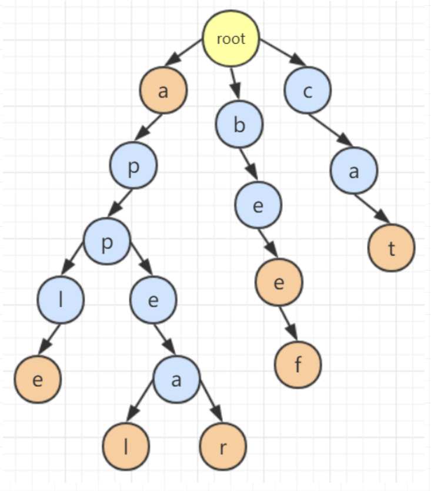

# 前缀树（Trie）

[对应模版题：leetcode208👈点击链接](https://leetcode.cn/problems/implement-trie-prefix-tree/description/)

要求你实现三个功能，一个加入单词，一个搜索单词，一个搜索前缀

## 从我的第一想法，维护两个哈希
一开始的直觉是：

- 用一个哈希存完整单词 → 用来搜索单词
- 用另一个哈希存放前缀

比如插入 `"apple"`：
- word_set = {"apple"}
- prefix_set = {"a", "ap", "app", "appl", "apple"}

这个思路的问题

- **空间爆炸**：每个单词长度是 L，要存 O(L²) 级别的字符
- **插入成本高**：要不断构造字符串前缀
- 本质是在“重复存公共前缀”

##  核心转折：前缀到底是什么？
关键认知：

> **前缀不是字符串，而是一条“路径”**

- `"app"` 和 `"apple"` 的 `"app"` 部分是**同一个前缀**
- 不应该被存两次

于是问题变成：
> 能不能把“前缀集合”压缩成一种共享结构？

答案就是：**Trie（前缀树）**

## Trie 的本质
> **Trie 是一棵树，每个节点代表一个前缀**

- 从 root 走到某个节点
- 这条路径拼起来，就是一个前缀

---

## 一个 Trie 节点必须存什么？
我们需要支持：

- 判断前缀是否存在
- 判断是否是完整单词

一个节点只需要两样东西：

```text
children：当前前缀后面，能接哪些字符，就是所有他子节点的集合
is_end：走到这里，是否是一个完整单词
```

对应到代码：

```
class Node:
    def __init__(self):
        self.children = {}   # 字典形式存在 {char : Node()对象} 
        					 # char 是唯一的，例如 {a:node_a, b:node_b}
        self.is_end = False
```

------

## Trie 的操作

搜索前缀的时候只要从根节点顺着找就可以了

搜索单词的时候相当于搜索前缀+判断最后一个节点是不是结尾节点，即`is_end = True`

## 图例


